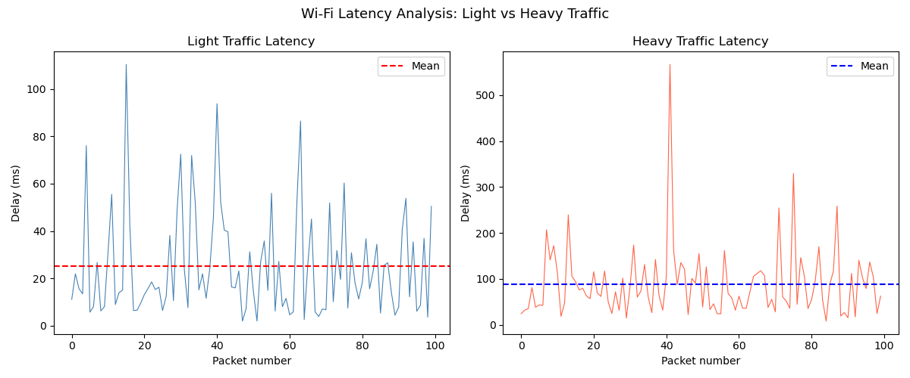

# Wi-Fi Latency Analyser

Network latency analysis tool built and run on Linux (Ubuntu),
measuring and comparing delay under light vs heavy traffic loads.

## What this project does
- Simulates 100 packets under light and heavy traffic conditions
- Measures min, max, mean, median, std deviation and 95th percentile delay
- Plots latency over time for both traffic conditions
- Demonstrates how heavy traffic increases latency 3.5x

## Key results
- Light traffic mean delay: 25.09 ms
- Heavy traffic mean delay: 89.07 ms
- 95th percentile under heavy load: 208.64 ms

## Technologies used
- Python 3 on Ubuntu Linux
- NumPy (statistical analysis)
- Matplotlib (visualisation)
- Ran entirely on Linux command line

## Results

## How to run
pip3 install numpy matplotlib
python3 latency_analyser.py
